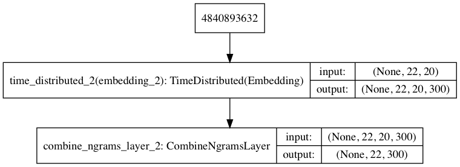
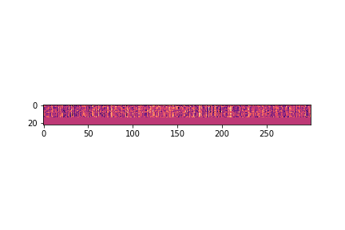
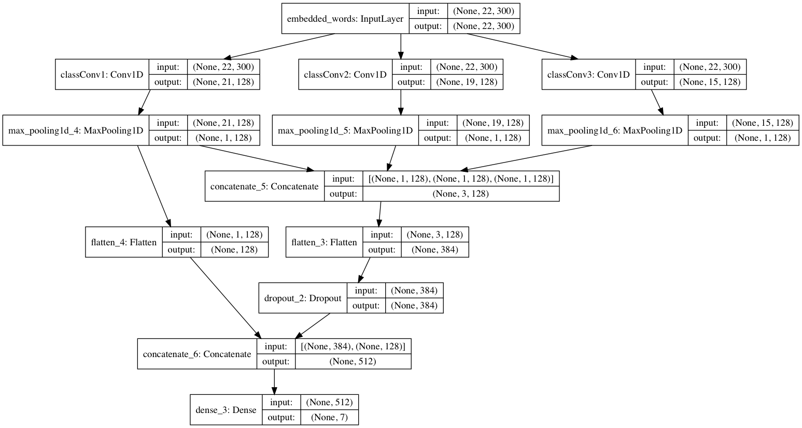
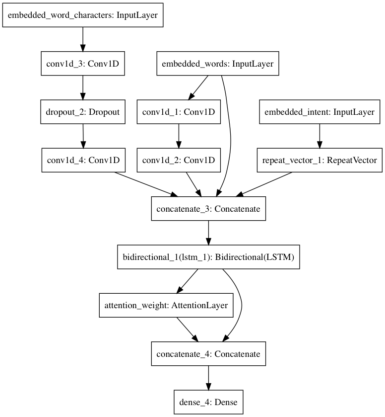

# Technical overview

Aida's NLP pipeline is composed of 3 models. The `Embeddings model` takes text sentences and encodes them to high dimensional vector representations. The `text classification model` takes the encoded sentences and predicts the intent of the sentence. And finally the `Named entity recognition model` takes the sentence embeddings by bigrams and the text classification output (the intent tags), and returns the sentence slots. Here is a more detailed description of the models.

### Embeddings model

Plot:



The embeddings model uses a pre-trained fastText dictionary of bigrams to form word representations. For text classification, the embeddings model first takes a sentence, then breaks the sentence into words and then splits the words by bigrams. Here is an example of this process (sentence => words => word bigrams):

```
"hi friend" => ["hi", "friend"] => [["hi"],["fr", "ri", "ie", "en", "nd"]]
```

 Then each word bigram is replaced by its 300 dimensional representation provided by fastText. Then we obtain a single 300 dimensional vector for each word of the sentence by the sum and average of the bigrams.

The dimension each sentence tensor is: `21 (length in words of the dataset longest sentence)` by `300 (embedding dimensions)`. Here is a visualization of the embeddings tensor given this sentence: `please remind to me watch real madrid match tomorrow at 9pm`




### Text classification model

Plot:



The text classification model is composed of 3 CNN layers concated and with a skip-layer connection and a dense layer output. The input is the output of the embeddings model for a given sentence using bigram embeddings and the ouput is the list of probabilities this sentence belongs to each of the classification classes.

Here is an animation of the 3 convolutional layers activations during training, we see the convolutional layer filters learn features from the 300 dimensional vector representations and also the output layer visualization. We pass the same sentence (`please remind to me watch real madrid match tomorrow at 9pm`) to the model at the end of each training batch (~50 batches) and plot the activations to see how they evolve as the model learns to classify. (note: frame 0 is empty for 1 second, and the last frame also pauses for 1 second).

First convolutional layer activations animation:


Second convolutional layer activations animation:


Third convolutional layer activations animation:


Output layer visualization:


NOTE: The model for text classification performs good and fast enough so there was no need to add a simple self-attention mechanism but it can be explored.

### Named entity recognition model
Plot:



The named entity recognition (NER) model uses 2 inputs. The sentence embeddings at the word bigrams level and the one hot encoded classification tag for the sentence (the text classification model output).

The training data is one-hot encoded with inside-outside (IO) tagging format. The model architecture uses a CNN at the sentence-word-bigram level concatenated with the classification tags repeated to match the length of words, then a bidirectional LSTM with no merge mode, with optional time-series attention mechanism applied only to the forward lstm, and a final dense output layer.

Given a sentence, the model will return its tags and the class of the tag. e.g.:
```json
{
  "sentence": "please remind to me watch real madrid match tomorrow at 9pm",
  "slots": {
    "dateTime": [{ "value": "tomorrow at 9am" }],
    "calendarEvent": [{ "value": "real madrid match" } ]
  }
}
```

Here is an animation of the 2 deep convolutional layers activations during training, we see the convolutional layer filters learn features from the 300 dimensional vector representations and also the output layer visualization. We pass the same sentence (`please remind to me watch real madrid match tomorrow at 9pm`) to the model at the end of each training batch (~50 batches) and plot the activations to see how they evolve as the model learns to perform NER. (note: frame 0 is empty for 1 second, and the last frame also pauses for 1 second).

First convolutional layer activations animation:


Second convolutional layer activations animation:


Output layer visualization:


## Visualization code snippets for python

There is code at `classification.py` and `ner.py` marked inside `# ===   Visualization code block   ===` comments that can be uncommented to generate images and then gif's of the activation progress for a given phrase. Also at the jupyter notebook, there is code for plotting the model diagrams.

# Resources

 - [Deep Active Learning for Named Entity Recognition](https://arxiv.org/abs/1707.05928) - NER model architecture based on CNN word level, CNN char level, and LSTM + attention decoder

 - [Named Entity Recognition with Bidirectional LSTM-CNNs](https://arxiv.org/abs/1511.08308) - NER model architecture based on CNN word level, CNN Char level, extra features and a biLSTM decoder

 - [Super-Convergence: Very Fast Training of Neural Networks Using Large Learning Rates](https://arxiv.org/abs/1708.07120) - Inspiring work on how to boost the learning speed of NN models.

 - [Automatic Inference, Learning, and Design using Probabilistic Programming](https://github.com/twgr/thesis/blob/master/main.pdf) - Inspiring work on probabilistic programming to simulate or generate datasets

- [Tensorflow Solutions for Text by Will Ballard](https://www.safaribooksonline.com/library/view/tensorflow-solutions-for/9781788399180/) - Excellent course on NLP (goes in depth on how to use fastText trigrams and implements attention mechanisms)

- [fastText](https://fasttext.cc/) - Pretrained embeddings based on ngram analysis for hundreds of languages

- [Keras](https://keras.io/) - High-level neural networks API in Python with almost the same api as Tensorflow.js

- [Tensorflow.js](https://js.tensorflow.org/) - High-level neural networks API in JavaScript with almost the same api as Keras

- [Chatito](https://github.com/rodrigopivi/Chatito) - Dataset generation DSL for text classification and NER tasks